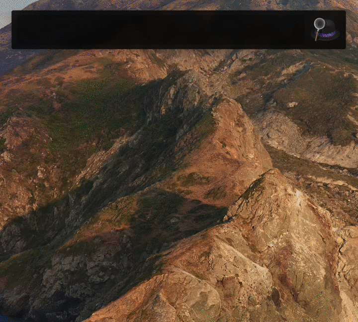

# Linguee Workflow for Alfred

[](https://www.alfredapp.com/)

[](https://github.com/sigito/Linguee-Workflow-for-Alfred/releases/latest)
[](https://twitter.com/sigito_is_taken)



## Download the workflow

The latest version of the workflow can be downloaded from [GitHub releases](https://github.com/sigito/Linguee-Workflow-for-Alfred/releases).

### Manually install the workflow

You can also build and install the workflow yourself. Just clone the repository and run the next command in Terminal from the directory with the cloned project:

```shell
make install
```

A new `Linguee.Search.alfredworkflow` workflow would be built from source and opened in Alfred.

## Features

* Rich search resulfts for query translations betwwen English and German.
* Use `l` keyword to search in Alfred.
  * The keyword is configurable in the Alfred workflow settings.
* Open the the translation page in a browser by hitting `↩` (Return) on the result entry.
* Open an initial search query in a browser:
  * `⌘ ↩` (Command-Return) on any search result, or
  * `↩` (Return) on "Search on Linguee for '{query}'". This entry is always added as the last search result.
* Search autocomplete on `↹` (Tab).
* Copy the results with `⌘ C` (Command-C).
* Display a selected result in a large type with `⌘ L` (Command-L).
* Quickly look at the tranlation page by tapping `⇧` (Shift) or `⌘ Y` (Command+Y).
* Automatic checks for updates.
  * Use `check_for_updates` variable to control this feature.
  * If a newer version of the workflow is available, an extra result row is added with [an update prompt](periodic_checks_for_updates.png).

### Setting a global keyboard schortcut

There is an option to trigger the Linguee Search from anywhere, skipping typing of the command prefix (`l` in our case) in the shared Alfred search window. Unfortunately, Alfred does not import the hotkeys, thus a manual setup is necessary.

The workflow already contains an empty global keyboard shortuct configuration. You should:

1. Open the workflows panel in Alfred settings.
1. Select this workflow.
1. Double-click on the "Hotkey" box in the workflow (alternatively right click and choose "Configure Object...").
1. Press the key combination that should be used as a system-wide shortcut. E.g., `⇧ ⌘ L` (Shift-Command-L).
1. Click "Save".

By default the shortcut would searched for the selected text, or open a ready-to-go Linguee search in Alfred.

To change the assigned key combination, just repeat the steps described above.

More about hotkeys in Alfred available [here](https://www.alfredapp.com/help/workflows/triggers/hotkey/).

### Setting translation language pair

`source_language` and `destination_language` define the language pair used for the translation.

Default pair is English + German. To override this behavior, set the variables to a desired pair. For a full list of available language pairs please visit <https://www.linguee.com/?moreLanguages=1#moreLanguages>. The values of the variables must be a lowercased language name in English. E.g., "english", "german", "french".

### Miscellaneous flags

* `check_for_updates` – whether the workflow should periodically check for a new version.  
  Possible values: `true` or `false`. Default: `false`.
* `disable_copy_text_promotion` – disables inclusion of a URL to this workflow in the copied result text.  
  Possible values: `true` or `false`. Default: `false`.
* `demo_mode` – return a stubbed response with all states available.  
  Possible values: `true` or `false`. Default: `false`.  
  **Attention**: setting this varibale would make the workflow to always return stubbed values.

## License

* The Linguee Workflow for Alfred is released under the MIT license. [See LICENSE](LICENSE) for details.
* The surved results are used according to Linguee's [Terms and Conditions](https://www.linguee.com/english-german/page/termsAndConditions.php).
* The icons are provided by [Susan Kaltschmidt](http://www.susan-kaltschmidt.com/).
